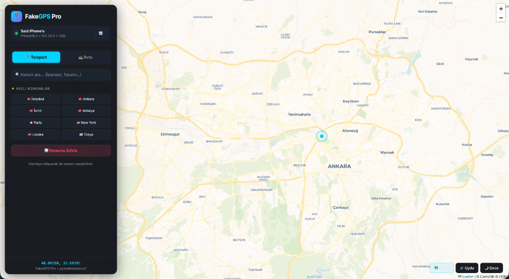
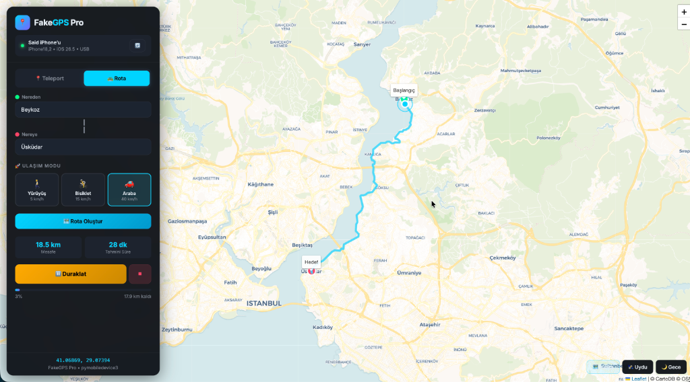

# 📍 FakeGPS Pro

**iPhone konum simülasyon aracı — Harita üzerinden ışınlan, rota çiz, yolculuk simüle et.**

<p align="center">
  
</p>

[](https://python.org)
[](https://flask.palletsprojects.com)
[]()
[]()
[]()

---

## ✨ Özellikler

### 📍 Teleport Modu
Haritaya tıkla veya konum ara — iPhone'un anında o konuma ışınlansın.
- 🔍 **Konum Arama** — Şehir, sokak, landmark yazarak bul
- ⚡ **Hızlı Konumlar** — İstanbul, Ankara, Paris, Tokyo... tek tıkla
- 🖱️ **Harita Tıklama** — İstediğin noktaya tıkla, anında ışınlan

### 🛣️ Rota Modu
Google Maps gibi "nereden → nereye" yaz, ulaşım modunu seç, yolculuğu simüle et.
- 📝 **Nereden / Nereye** — Adres veya konum adı yaz, otomatik tamamlasın
- 🗺️ **Gerçek Yol Rotası** — OSRM ile gerçek yolları takip eden rota çizer (düz çizgi değil!)
- 🚶🚴🚗 **Ulaşım Modları** — Yürüyüş (5 km/h), Bisiklet (15 km/h), Araba (40 km/h)
- ▶️⏸️⏹️ **Kontroller** — Başlat, Duraklat, Durdur
- 📊 **İlerleme Takibi** — Mesafe, tahmini süre, kalan yol

<p align="center">
  
</p>

### 🗺️ Harita Seçenekleri
Sağ alttaki butonlarla harita görünümünü değiştir:
- 🗺️ **Harita** — Renkli, detaylı sokak haritası
- 🛰️ **Uydu** — Uydu görüntüsü
- 🌙 **Gece** — Karanlık tema

---

## 💻 Desteklenen Platformlar

| Platform | Durum | Not |
|---|---|---|
| 🍎 macOS | ✅ Tam destek | Doğrudan çalışır |
| 🪟 Windows | ✅ Tam destek | iTunes gerekli (USB sürücüleri için) |
| 🐧 Linux | ✅ Tam destek | usbmuxd gerekli |

**iPhone Gereksinimleri:**
- iOS 17 veya üzeri
- Developer Mode açık
- USB data kablosu (şarj kablosu değil!)

---

## 🚀 Kurulum

### macOS

```bash
# 1. Repoyu indir
git clone https://github.com/saidsurucu/FakeGPS.git
cd FakeGPS

# 2. Bağımlılıkları kur
pip3 install -r requirements.txt

# 3. Çalıştır
chmod +x start_mac.sh
./start_mac.sh
```

Veya hızlı başlangıç:
```bash
./start_mac.sh
```
Script otomatik olarak bağımlılıkları kontrol eder ve kurar.

### Windows

```powershell
# 1. Python 3.8+ indir: https://python.org
# 2. iTunes indir: Microsoft Store'dan
# 3. Repoyu indir (ZIP veya git clone)

# 4. Çift tıkla:
start_windows.bat
```

---

## 📖 Kullanım

### Adım 1: Tunnel Başlat (bir kez)

Ayrı bir terminal/komut istemi aç ve çalıştır:

**macOS / Linux:**
```bash
sudo python3 -m pymobiledevice3 remote start-tunnel --protocol tcp
```

**Windows (Yönetici olarak çalıştır):**
```powershell
python -m pymobiledevice3 remote start-tunnel --protocol tcp
```

Çıktıda şunu göreceksin:
```
RSD Address: fd7b:e5b:6f53::1
RSD Port: 64337
```
> ⚠️ Bu terminali **açık bırak**, kapatma!

### Adım 2: FakeGPS Pro'yu Başlat

Başka bir terminal aç:
```bash
./start_mac.sh        # macOS
start_windows.bat     # Windows
```

Tarayıcın otomatik açılacak: **http://127.0.0.1:5555**

### Adım 3: Bağlan

1. Sol panelde **RSD Address** ve **Port** değerlerini gir (tunnel çıktısından)
2. **⚡ Bağlan** butonuna tıkla
3. Yeşil nokta yanarsa bağlantı başarılı! ✅

### Adım 4: Kullan!

**📍 Teleport:**
- Haritaya tıkla → anında o konuma ışınlan
- Veya arama çubuğuna "İstanbul" yaz → seç → ışınlan

**🛣️ Rota:**
1. "Rota" sekmesine geç
2. **Nereden:** başlangıç konumunu yaz (örn: "Beykoz")
3. **Nereye:** hedef konumu yaz (örn: "Üsküdar")
4. 🚶🚴🚗 ulaşım modunu seç
5. **🗺️ Rota Oluştur** → haritada rota çizilir
6. **▶️ Yola Çık** → simülasyon başlar!

---

## 📱 iPhone Ayarları

### Developer Mode Açma
1. **Ayarlar** → **Gizlilik ve Güvenlik** → **Geliştirici Modu**
2. Aç → iPhone yeniden başlar
3. Açılınca onay ver

### WhatsApp Canlı Konum İçin
Sahte konumun WhatsApp'ta çalışması için:
1. **Ayarlar** → **WhatsApp** → **Konum**
2. **Her Zaman** (Always) seç

---

## 🛠️ Teknik Detaylar

| Bileşen | Teknoloji |
|---|---|
| Backend | Python + Flask |
| Frontend | HTML + CSS + JavaScript |
| Harita | Leaflet.js + CartoDB / Esri |
| Rota | OSRM (Open Source Routing Machine) |
| Arama | Nominatim (OpenStreetMap) |
| iOS Bağlantı | pymobiledevice3 |
| Protokol | TCP (USB üzerinden) |

### RAM Kullanımı
- ~100-150 MB RAM
- **2 GB RAM'li bilgisayarda bile rahat çalışır**

---

## ❓ SSS

<details>
<summary><b>Tunnel başlatırken hata alıyorum</b></summary>

- `--protocol tcp` flag'ini eklediğinden emin ol
- macOS'ta `sudo` kullan, Windows'ta "Yönetici olarak çalıştır"
- iPhone'da "Bu Bilgisayara Güven" onayını ver
</details>

<details>
<summary><b>QUIC protocol error hatası</b></summary>

`--protocol tcp` ekle:
```bash
sudo python3 -m pymobiledevice3 remote start-tunnel --protocol tcp
```
</details>

<details>
<summary><b>Konum değişmiyor</b></summary>

- Developer Mode açık mı kontrol et
- Tunnel terminali hala açık mı kontrol et
- RSD adresi ve port doğru mu kontrol et
</details>

<details>
<summary><b>Windows'ta cihaz algılanmıyor</b></summary>

- iTunes yüklü mü? (Microsoft Store'dan indir)
- USB kablosu data kablosu mu? (şarj kablosu çalışmaz)
- iPhone'da "Bu Bilgisayara Güven" onayını ver
</details>

---

## 📄 Lisans

MIT License — istediğin gibi kullan, değiştir, dağıt.

---

## 🙏 Katkıda Bulun

Pull request'ler memnuniyetle karşılanır! Issue açarak hata bildirimi yapabilirsin.

---

<p align="center">
  <b>FakeGPS Pro</b> ile dünyanın her yerinde ol! 🌍
</p>
